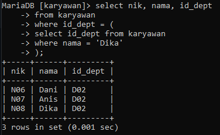
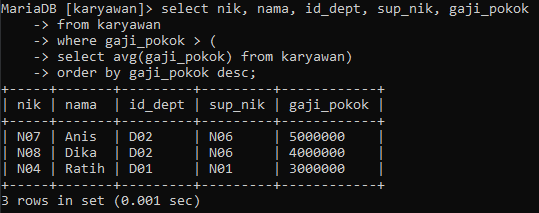
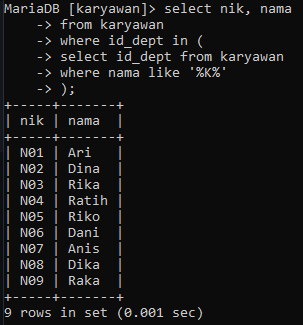
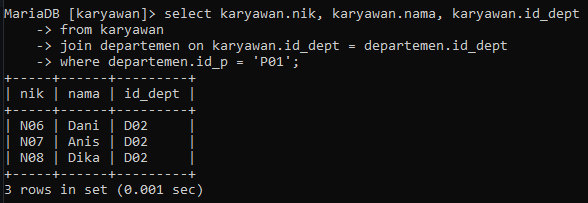
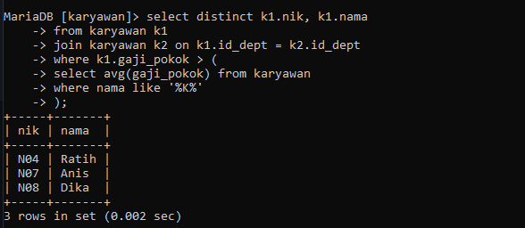

# Praktikum 6

1. Tampilkan data karyawan yang bekerja pada departemen yang sama dengan karyawan yang bernama Dika.

2. Tampilkan data karyawan yang gajinya lebih besar dari rata-rata gaji semua karyawan. urutkan menurun berdasarkan besaran gaji.

3. Tampilkan nik dan nama karyawan untuk semua karyawan yang bekerja di department yang sama dengan karyawan dengan nama yang mengandung huruf 'K'.

4. Tampilkan data karyawan yang bekerja pada departemen yang ada di kantor pusat.

5. Tampilkan nik dan nama karyawan untuk semua karyawan yang bekerja di department yang sama dengan karyawan dengan nama yang mengandung huruf 'K' dan yang gajinya lebih besar dari rata-rata gaji semua karyawan.

